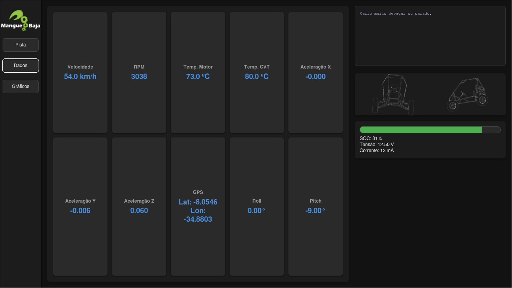

# Mangue Baja Telemetry System


Welcome to the official repository for the **Mangue Baja Telemetry System**.  
This project was developed by the Mangue Baja team to provide a robust, real-time telemetry solution for our Baja SAE vehicle.  
We believe in the power of open source and are excited to share our work with the Baja SAE community.

If you find this project useful, please consider giving it a ⭐!

---

## Screenshots

Here are some previews of the telemetry system in action:

- **Dashboard View**  
  

- **Real-time Map**  
  

- **Crude Data Visualization**  
  

---

## Table of Contents

- [About the Project](#about-the-project)
  - [Backend](#backend)
  - [Frontend](#frontend)
  - [Starter Script](#starter-script)
- [Features](#features)
- [Getting Started](#getting-started)
  - [Prerequisites](#prerequisites)
  - [Installation](#installation)
- [Usage](#usage)
  - [Running the System](#running-the-system)
  - [Configuration](#configuration)
- [Project Structure](#project-structure)
- [License](#license)
- [Contact](#contact)

---

## About the Project

This telemetry system is designed to be a high-performance, user-friendly tool for monitoring all critical aspects of our Baja SAE vehicle in real-time. We chose a modern tech stack to ensure the system is both powerful and easy to maintain.

### Backend

The backend is built with **Python** and **FastAPI**, providing a high-performance API and WebSocket server. The key advantages of this approach are:

- **Simplicity**: Python's clean syntax makes the code accessible to the entire team.  
- **Extensive Libraries**: We leverage powerful libraries for MQTT, WebSocket communication, and more.  
- **Performance**: FastAPI provides a level of performance comparable to Go and Node.js.  

### Frontend

The frontend is a **React application** built with **TypeScript** and **Vite**. This combination offers:

- **Rich UI**: A wide variety of React libraries allow for the creation of a dynamic and responsive user interface.  
- **Type Safety**: TypeScript helps to catch errors early in the development process.  
- **High Performance**: The frontend is capable of rendering a high volume of data points without noticeable latency.  

### Starter Script

To make the system accessible to all team members, regardless of their technical expertise, we have included a **`starter.py`** script. This script provides a simple graphical interface to:

- Install all necessary dependencies.  
- Start and stop the backend and frontend servers.  
- Open the telemetry interface in a web browser.  

---

## Features

| Feature | Status |
|---------|--------|
| **Starter** | |
| Simple Installer and Launcher | ✅ |
| Turn the starter into an app hub | 🚧 |
| Complete Documentation | 🚧 |
| **Backend (server)** | |
| Telemetry broadcast via MQTT | ✅ |
| Data storage with SQLite | ✅ |
| Data simulation for testing | ✅ |
| ENV-based authentication | ✅ |
| Telemetry broadcast via LoRa | ✅ |
| Replay of past sessions | 🚧 |
| Debug and ECU "box" interface | 🚧 |
| Apply filters from iLogger | 🚧 |
| Build executable | 🚧 |
| **Frontend (interface)** | |
| Data reception and processing | ✅ |
| Real-time map | ✅ |
| Real-time car model | ✅ |
| Real-time serial analysis | ✅ |
| Display of all critical data | ✅ |
| Battery status | ✅ |
| Real-time graphs | ✅ |
| Replay interface | 🚧 |
| Predictive failure neural network | 🚧 |
| Debug and ECU "box" interface | 🚧 |
| Data visualization page for iLogger | 🚧 |
| Build executable | 🚧 |

---

## Getting Started

To get a local copy up and running, follow these simple steps.

### Prerequisites

- Python **3.11+**  
- Node.js and npm  

### Installation

Clone the repo:

```bash
git clone https://github.com/pchagas72/mangue-telemetry.git
```

Install backend dependencies:

```bash
cd server
python3 -m venv venv
source venv/bin/activate  # On Windows use `venv\Scripts\activate`
pip install -r requirements.txt
```

Install frontend dependencies:

```bash
cd ../interface
npm install
```

---

## Usage

You can run the system using either the **starter script** or by running the frontend and backend separately.

### Running the System

The easiest way to get started is to use the starter script:

```bash
python3 starter.py
```

Alternatively, you can run the frontend and backend in separate terminals:

**Backend:**

```bash
cd server
source venv/bin/activate  # On Windows use `venv\Scripts\activate`
python3 run.py
```

**Frontend:**

```bash
cd interface
npm run dev
```

The interface will be available at:  
👉 [http://localhost:5173](http://localhost:5173)

### Configuration

The server can be configured by creating a `.env` file in the **server** directory.  
You can use the `credentials.env` file as a template.

---

## Project Structure

```
.
├── LICENSE
├── README.md
├── docs/             # Screenshots and documentation assets
├── interface/        # Frontend (React + Vite + TypeScript)
├── server/           # Backend (Python + FastAPI + MQTT)
└── starter.py        # The starter script
```

=======
```

Install backend dependencies:

```bash
cd server
python3 -m venv venv
source venv/bin/activate  # On Windows use `venv\Scripts\activate`
pip install -r requirements.txt
```

Install frontend dependencies:

```bash
cd ../interface
npm install
```

---

## Usage

You can run the system using either the **starter script** or by running the frontend and backend separately.

### Running the System

The easiest way to get started is to use the starter script:

```bash
python3 starter.py
```

Alternatively, you can run the frontend and backend in separate terminals:

**Backend:**

```bash
cd server
source venv/bin/activate  # On Windows use `venv\Scripts\activate`
python3 run.py
```

**Frontend:**

```bash
cd interface
npm run dev
```

The interface will be available at:  
👉 [http://localhost:5173](http://localhost:5173)

### Configuration

The server can be configured by creating a `.env` file in the **server** directory.  
You can use the `credentials.env` file as a template.

---

## Project Structure

```
.
├── LICENSE
├── README.md
├── interface/        # Frontend (React + Vite + TypeScript)
├── server/           # Backend (Python + FastAPI + MQTT)
└── starter.py        # The starter script
```

---

## License

Distributed under the **MIT License**.  
See `LICENSE` for more information.

---

## Contact

🔗 Project Link: [https://github.com/pchagas72/mangue-telemetry](https://github.com/pchagas72/mangue-telemetry)
