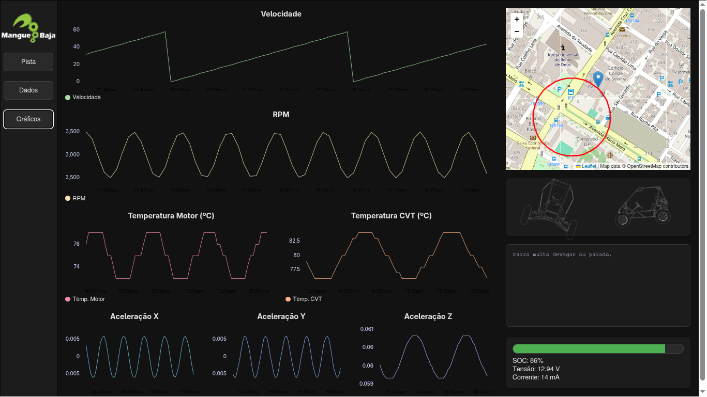
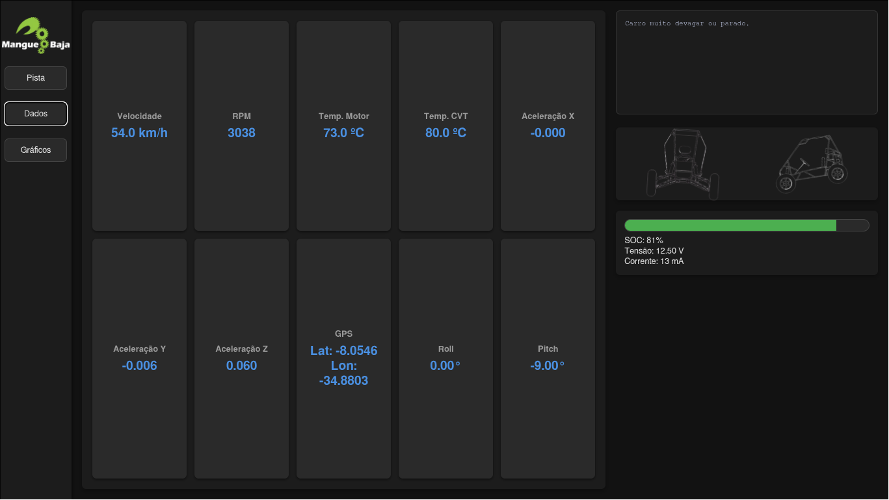

# Mangue Baja - Sistema de Telemetria


---

## 📸 Screenshots


- **Dashboard View**  
  

- **Real-time Map**  
  

- **Crude Data Visualization**  
  


---

## 📑 Sumário

- [Sobre o Projeto](#sobre-o-projeto)
  - [Backend](#backend)
  - [Frontend](#frontend)
  - [Starter Script](#starter-script)
- [Funcionalidades](#funcionalidades)
- [Primeiros Passos](#primeiros-passos)
  - [Pré-requisitos](#pré-requisitos)
  - [Instalação](#instalação)
- [Uso](#uso)
  - [Executando o Sistema](#executando-o-sistema)
  - [Configuração](#configuração)
- [Estrutura do Projeto](#estrutura-do-projeto)
- [Licença](#licença)
- [Contato](#contato)

---

## 🚗 Sobre o Projeto

Este sistema de telemetria foi desenvolvido para monitorar em **tempo real** os principais parâmetros do veículo Baja SAE da equipe **Mangue Baja**.  
A proposta é unir **alta performance**, **facilidade de uso** e **abertura à comunidade open source**.

### Backend

- Construído em **Python** com **FastAPI**.  
- Oferece API e WebSocket de alto desempenho.  
- Principais vantagens:
  - **Simplicidade**: sintaxe clara do Python.  
  - **Bibliotecas extensas**: suporte a MQTT, WebSocket etc.  
  - **Performance**: FastAPI atinge níveis próximos de Go e Node.js.  

### Frontend

- Aplicação em **React** com **TypeScript** + **Vite**.  
- Vantagens:
  - **UI rica**: uso de bibliotecas React para interface responsiva.  
  - **Segurança de tipos** com TypeScript.  
  - **Alta performance** para lidar com grande volume de dados.  

### Starter Script

Inclui o **starter.py**, que facilita o uso para toda a equipe:
- Instala dependências.  
- Inicia/para backend e frontend.  
- Abre a interface no navegador.  

---

## ✨ Funcionalidades

| Recurso                        | Status |
|--------------------------------|--------|
| **Starter**                    |        |
| Instalador e lançador simples  | ✅      |
| Transformar em "hub" de apps   | 🚧      |
| Documentação completa           | 🚧      |
| **Backend (servidor)**         |        |
| Broadcast via MQTT             | ✅      |
| Armazenamento em SQLite        | ✅      |
| Simulação de dados             | ✅      |
| Autenticação via `.env`        | ✅      |
| Broadcast via LoRa             | ✅      |
| Replay de sessões passadas     | 🚧      |
| Interface de debug/ECU box     | 🚧      |
| Filtros do iLogger             | 🚧      |
| Build executável               | 🚧      |
| **Frontend (interface)**       |        |
| Recepção e processamento       | ✅      |
| Mapa em tempo real             | ✅      |
| Modelo do carro em tempo real  | ✅      |
| Análise serial em tempo real   | ✅      |
| Exibição de dados críticos     | ✅      |
| Status da bateria              | ✅      |
| Gráficos em tempo real         | ✅      |
| Interface de replay            | 🚧      |
| Rede neural preditiva          | 🚧      |
| Interface de debug/ECU box     | 🚧      |
| Página iLogger                 | 🚧      |
| Build executável               | 🚧      |

---

## 🛠️ Primeiros Passos

### Pré-requisitos

- **Python 3.11+**  
- **Node.js + npm**  

### Instalação

```bash
# Clonar repositório
git clone https://github.com/pchagas72/mangue-telemetry.git
```

**Instalar backend**

```bash
cd server
python3 -m venv venv
source venv/bin/activate  # No Windows: venv\Scripts\activate
pip install -r requirements.txt
```

**Instalar frontend**

```bash
cd ../interface
npm install
```

---

## ▶️ Uso

### Executando o Sistema

**Mais fácil:**

```bash
python3 starter.py
```

**Manual:**

Backend:  
```bash
cd server
source venv/bin/activate  # No Windows: venv\Scripts\activate
python3 run.py
```

Frontend:  
```bash
cd interface
npm run dev
```

Interface disponível em: [http://localhost:5173](http://localhost:5173).

### Configuração

Crie um arquivo `.env` dentro de `server/`.  
Use `credentials.env` como modelo.

---

## 📂 Estrutura do Projeto

```
.
├── LICENSE
├── README.md
├── interface/        # Frontend (React + Vite + TypeScript)
├── server/           # Backend (Python + FastAPI + MQTT)
└── starter.py        # Script inicializador
```

---

## 📜 Licença

Distribuído sob a licença MIT. Veja `LICENSE` para mais detalhes.

---

## 📬 Contato

Link do projeto: [Mangue Telemetry](https://github.com/pchagas72/mangue-telemetry)
